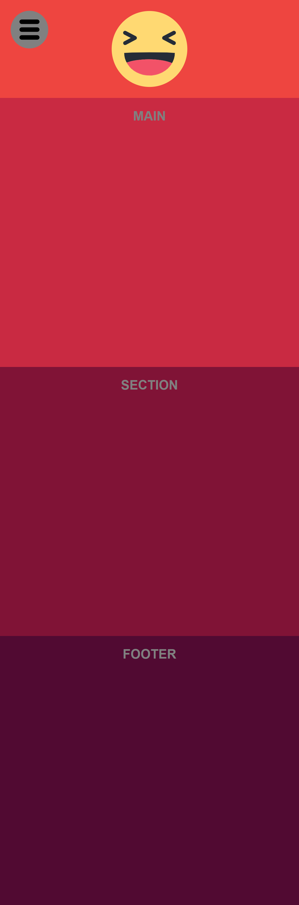
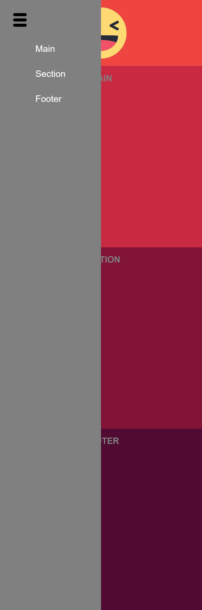

# Burger-button 👉🏼 🍔
Codigo para el armado de un "Menú hamburguesa"  basico, utilizando html, css y javascript. El mokup cuenta con 1 header, 1 main, 1 section y 1 footer. En el header tenemos el "menú" con sus liks que nos redirigen hacia las diferentes secciones de la página. El burger-button permanece oculto hasta que el viewport tiene las medidas de un dispositivo movil, a partir de dicho breack point aparece. Al hacerle click al burger-button se despliega lateralmente el menú.

####Puntos a tener en cuenta:

- El elemento "nav" contiene a nuestro menú.
- A "nav" se le asignó 2 selectores por clase: 
	- menu-oculto
	- menu-activo
- Los estilos de ambas clases son incorporadas dentro del media queries con el breack point correspondiente a dispositivo movil (por ejemplo desde los 479px hacia abajo).
- Primero declaro los estilos de "menu-activo" y recién luego el de "menu-oculto". Importante por la disposición en cascada de Css
- "menu-oculto" hereda todos los estilos de "menu-activo". Sin embargo presenta una diferencia: left: -50vw;
- Esto último le permite al menú permanecer oculto hacia la izquierda del viewport.

####Javascript
```javascript
<script>
	document.querySelector ('.menu-activo');
    document.querySelector ('.burger-icon');

	const menu = document.querySelector ('.menu-activo');
    const burgerButton = document.querySelector ('.burger-icon');

	console.log (menu);
    console.log (burgerButton);
	
	// EVENTO SOBRE EL BURGER-BUTTON
    burgerButton.addEventListener ('click', desplegar);
	
	// FUNCIÓN para que DESPLIEGUE Y SE OCULTE EL MENU
    function desplegar () {
        if (menu.classList.contains ('menu-oculto')) {
                menu.classList.remove ('menu-oculto');
        }
        else {
            menu.classList.add ('menu-oculto');
        }
    }
</script
```
<div style="display: flex;">
    
    
</div>